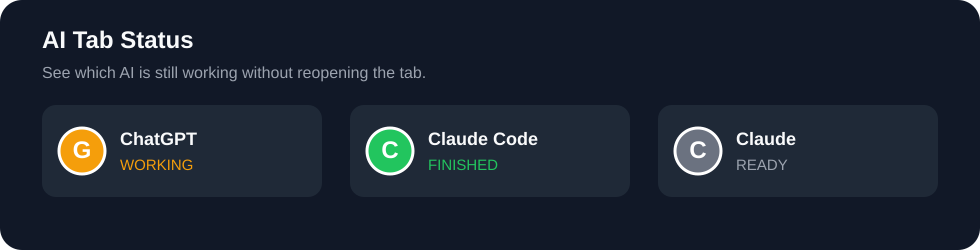

# AI Tab Status

Know when **ChatGPT** or **Claude Code** is actually done — without constantly reopening their tabs.

AI Tab Status is a lightweight userscript that turns the browser tab favicon into a live status indicator and plays a short sound when the AI has really finished.

Every supported AI interface can move through the same three states: **ready**, **working**, and **finished**.

## Why

When you run ChatGPT and Claude Code in parallel, checking both tabs repeatedly wastes time. AI Tab Status makes the state visible at a glance:

| Interface | Ready / idle | Working | Finished |
| --- | --- | --- | --- |
| ChatGPT | ⚪ `G` | 🟠 `G` | 🟢 `G` |
| Claude Code | ⚪ `C` | 🟠 `C` | 🟢 `C` |

Claude Web uses the same `C` indicator and the same color states.

The script **never changes the tab title**.

## Key feature: real Claude Code completion

Claude Code can return an intermediate message while a command or background task is still running. A naive detector announces completion too early.

AI Tab Status keeps Claude Code orange while either:

- the active Claude Code turn is still running; or
- one or more Claude Code background tasks are still running.

The tab turns green and the completion sound plays only after Claude Code is truly idle.

## Supported browsers

- Firefox
- Brave
- Google Chrome
- Microsoft Edge and other Chromium-based browsers

## Supported AI interfaces

- ChatGPT Web
- Claude Web
- Claude Code Web / Remote Control

## Install

### 1. Install a userscript manager

Install one of these browser extensions:

- **Tampermonkey**
- **Violentmonkey**

### 2. Install AI Tab Status

Open the userscript directly:

**[Install AI Tab Status](https://raw.githubusercontent.com/LimitlessLtdd/ai-tab-status/main/src/ai-tab-status.user.js)**

Your userscript manager should open an installation screen. Confirm the installation, then reload ChatGPT or Claude.

### 3. Enable completion sound

Browsers can block audio until you interact with a page. After opening ChatGPT or Claude, click once inside the page. After that, the completion sound can play normally.

## Browser-specific behavior

The project ships as **one universal userscript**. It automatically selects the correct favicon strategy:

- Firefox uses a PNG data favicon and preserves the site's native favicon declarations.
- Brave / Chrome / Edge use a Chromium-specific SVG favicon strategy to avoid favicon caching and replacement issues.

No browser-specific installation choice is required.

## Privacy

AI Tab Status runs locally in your browser.

- No analytics
- No tracking
- No external API calls
- No conversation content is sent anywhere
- No account credentials are accessed

The script only observes UI state in the ChatGPT and Claude web pages.

## Updating

Tampermonkey and Violentmonkey can update the script automatically through the `@updateURL` metadata included in the userscript.

## Troubleshooting

If the icon does not update:

1. make sure only one version of AI Tab Status is enabled;
2. reload the AI tab;
3. confirm the userscript manager is allowed on `chatgpt.com` and `claude.ai`;
4. see [Troubleshooting](docs/troubleshooting.md).

If ChatGPT or Claude changes its web UI, detection selectors may need to be updated. Please open an issue with your browser, the affected interface, and a screenshot or DOM marker if possible.

## Contributing

Bug reports and pull requests are welcome. See [CONTRIBUTING.md](CONTRIBUTING.md).

## Roadmap

- Keep ChatGPT and Claude Code selectors current
- Improve localization support for Claude Code background-task labels
- Optional desktop notifications
- Optional user-configurable sounds and colors
- Additional AI web interfaces when reliable completion markers exist

## License

MIT — see [LICENSE](LICENSE).

---

If this saves you time while running multiple AI agents, consider starring the repository. It helps other developers discover the tool.
